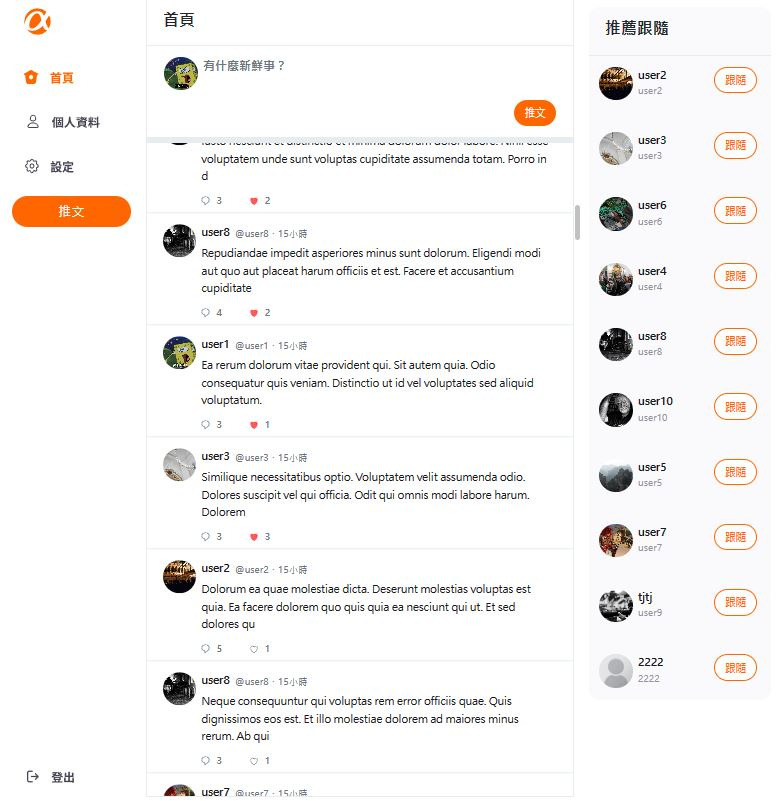

# ✨Simple Twitter 前後端協作專案 🚀

## 作品連結：[Simpe Twitter](https://ywcheng1207.github.io/Twitter/login)

## 這邊是前端 repo，後端部分請看：[後端連結](https://github.com/tschiang23/twitter-api-2020)
## 頁面截圖：



## 👋 功能說明

前台：<br/>
使用者可以註冊/登入帳號、推文、回覆推文、設定帳號資料、編輯個人資訊、跟隨/取消跟隨其他使用者、查看單一偏貼文及該篇文章的回覆內容。<br/>

後台：<br/>
管理者可以登入帳號、觀看推文清單及使用者列表、刪除推文。

## 👋 使用說明

      1.  確認已經安裝 node.js 與 npm
      2.  clone 專案
      3.  終端機進入資料夾並輸入：`$ npm install `
      4.  安裝完畢後，繼續輸入：`$ npm run start`

## 👋 測試帳號

      前台：

      ```
      Account: user1
      Password: 12345678
      ```

      後台：

      ```
      Account: root
      Password: 12345678
      ```

## 👋 開發工具

    "axios": "^0.27.2",
    "bootstrap": "^5.3.0",
    "clsx": "^1.2.1",
    "gh-pages": "^4.0.0",
    "react": "^18.2.0",
    "react-bootstrap": "^2.7.4",
    "react-router-dom": "^6.12.0",
    "sass": "^1.62.1",
    "eslint": "^8.42.0",
    "eslint-config-standard": "^17.1.0",
    "standard": "^17.0.0"
